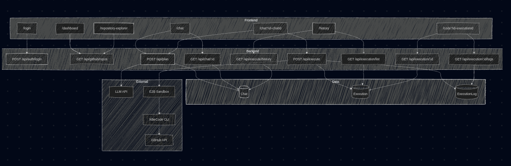
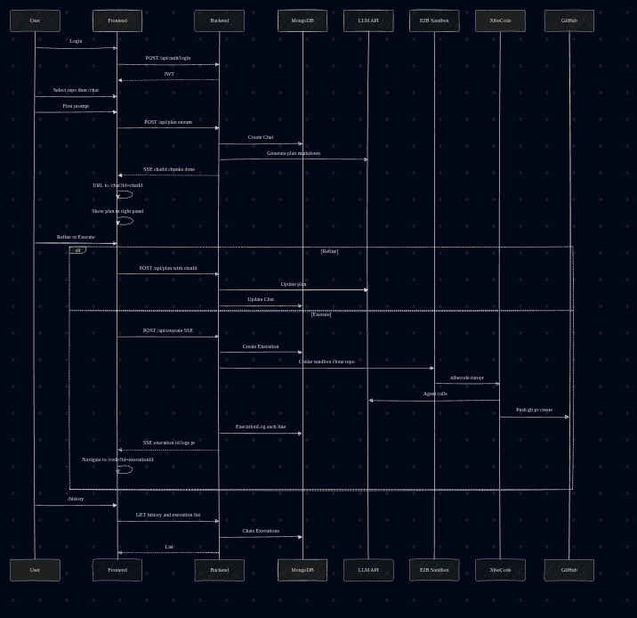

# Plasma AI — Aakrithi

AI-powered coding assistant that turns natural language into execution plans, runs [XibeCode](https://github.com/iotserver24/Xibe-cli) inside an [E2B](https://e2b.dev) sandbox to modify a GitHub repository, and automatically opens a Pull Request.

**Repository:** [https://github.com/iotserver24/plasma-ai-akrithi](https://github.com/iotserver24/plasma-ai-akrithi)

---

## Architecture



## User and data flow



---

## Stack

| Layer        | Technology |
|-------------|------------|
| Frontend    | Next.js 16 (App Router), React 19, Tailwind CSS 4 |
| Backend     | Node.js, Express (ESM) |
| Database    | MongoDB (Mongoose) |
| AI planning | OpenAI-compatible API (e.g. proxy with Anthropic/OpenAI models) |
| AI agent    | [XibeCode](https://github.com/iotserver24/Xibe-cli) CLI |
| Sandbox     | [E2B](https://e2b.dev) (custom `plasma-xibecode-v3` template) |
| Package manager | Bun |

---

## Pages & routes

| Route | Description |
|-------|-------------|
| `/login` | Username + password login (credentials from backend `.env`) |
| `/dashboard` | Dashboard entry; configure GitHub and go to repository explorer |
| `/repository-explorer` | List and select a GitHub repository; “Use this repository” → `/chat` |
| `/chat` | New planning session: describe a change, get a markdown plan (streamed) in the right panel |
| `/chat?id=<chatId>` | Existing chat: view messages + plan, refine plan, or Execute |
| `/code?id=<executionId>` | Execution view: live logs (ANSI-rendered), PR link, metadata |
| `/history` | Chat history + Work history (executions) side by side |

---

## Environment variables

### `backend/.env`

Copy from `backend/.env.example` if present, or create `backend/.env` and fill as below.

| Variable | Required | Description | Example |
|----------|----------|-------------|---------|
| `APP_USERNAME` | Yes | Login username for the app | `admin` |
| `APP_PASSWORD` | Yes | Login password | `password` |
| `JWT_SECRET` | Yes | Secret for signing JWT tokens; use a long random string | `your-super-secret-key-min-32-chars` |
| `MONGODB_URI` | Yes | MongoDB connection string | `mongodb://localhost:27017/plasma-ai` or Atlas URI |
| `E2B_API_KEY` | Yes | API key from [e2b.dev](https://e2b.dev) | `e2b_xxxx` |
| `E2B_TEMPLATE_ALIAS` | Yes | E2B template alias used for sandboxes | `plasma-xibecode-v3` |
| `GITHUB_TOKEN` | Yes | GitHub Personal Access Token (repo scope) for cloning and PRs | `ghp_xxxx` |
| `ANTHROPIC_API_KEY` | Yes | API key for plan LLM and XibeCode (or your proxy key) | `sk-xxxx` or proxy key |
| `ANTHROPIC_BASE_URL` | No | Base URL for plan + agent API (OpenAI-compatible) | `https://api.openai.com/v1` or proxy URL |
| `ANTHROPIC_MODEL` | No | Model ID for plan + agent | `gpt-4o-mini`, `claude-3-5-sonnet`, or proxy model |
| `FRONTEND_URL` | No | Frontend origin for CORS | `http://localhost:3001` |
| `PORT` | No | Backend port | `4000` or `5001` |
| `SESSION_SECRET` | No | Session secret if using sessions | any random string |

**Notes:**

- Plan generation uses **OpenAI-compatible** `POST /v1/chat/completions` at `ANTHROPIC_BASE_URL` with `Authorization: Bearer ANTHROPIC_API_KEY`.
- XibeCode in the sandbox is configured with the same key/base URL/model via env passed into E2B.

### `frontend/.env.local`

| Variable | Required | Description | Example |
|----------|----------|-------------|---------|
| `NEXT_PUBLIC_API_URL` | Yes | Backend API base URL (no trailing slash) | `http://localhost:4000/api` |

---

## Setup

### 1. Backend

```bash
cd backend
cp .env.example .env   # if exists, else create .env with the table above
# Edit .env and set all required variables
bun install
bun dev
```

### 2. Frontend

```bash
cd frontend
cp .env.local.example .env.local   # if exists
# Set NEXT_PUBLIC_API_URL to your backend API URL (e.g. http://localhost:4000/api)
bun install
bun dev
```

### 3. MongoDB

- **Local:** run `mongod` and set `MONGODB_URI` in `backend/.env`.
- **Atlas:** create a cluster, get the connection string, set `MONGODB_URI`.

### 4. E2B template (first time or after changes)

Build and push the custom template (XibeCode + deps pre-installed):

```bash
cd backend
bunx tsx e2b-template/build.ts
```

Use the same alias in `backend/.env` as `E2B_TEMPLATE_ALIAS` (e.g. `plasma-xibecode-v3`).

---

## How it works (summary)

1. User logs in; selects a repo in Repository Explorer; goes to `/chat`.
2. First message is sent to `POST /api/plan`; backend creates a **Chat** in MongoDB, calls the OpenAI-compatible API for a markdown plan, streams it back; frontend updates URL to `/chat?id=chatId` and shows the plan in the right panel.
3. User can send more messages to refine the plan (same `/api/plan` with `chatId`); plan is updated and stored.
4. “Execute” calls `POST /api/execute`; backend creates an **Execution**, spins up an E2B sandbox, clones the repo, runs **XibeCode** (`xibecode run-pr`) with your API key/base URL/model; XibeCode edits code and opens a PR via GitHub.
5. Logs are persisted as **ExecutionLog** and streamed via SSE; frontend shows them on `/code?id=executionId` with PR link and metadata.
6. `/history` lists chats and executions from MongoDB.

---

## Open source & third-party attribution

This project builds on and acknowledges the following:

- **[XibeCode](https://github.com/iotserver24/Xibe-cli)** — AI-powered autonomous coding agent (CLI). Used inside E2B sandboxes to implement edits and create pull requests. XibeCode is developed by **Anish Kumar** ([@iotserver24](https://github.com/iotserver24)). We thank the XibeCode project and its author for enabling this workflow.
- **[E2B](https://e2b.dev)** — Cloud sandboxes for running code securely. We use E2B to run XibeCode and Git operations in isolation.
- **[Next.js](https://nextjs.org)** — React framework (Vercel).
- **[Express](https://expressjs.com)** — Backend web framework.
- **[MongoDB](https://www.mongodb.com)** / **Mongoose** — Database and ODM.
- **Tailwind CSS** — Styling.
- **React Markdown** — Rendering markdown plans.
- **ansi-to-html** — Rendering ANSI-colored logs in the execution view.

We are grateful to all open source maintainers and the **XibeBase** team for their work.

---

## Credits — XibeBase team

Plasma AI — Aakrithi was built with support and tooling from the **XibeBase** team:

| Name | GitHub |
|------|--------|
| Anish Kumar | [@iotserver24](https://github.com/iotserver24) |
| Avyakta S | [@avyakta-dev](https://github.com/avyakta-dev) |
| Priaanka | [@mpriaanka](https://github.com/mpriaanka) |
| Anusha S | [@anusha2128](https://github.com/anusha2128) |

Special thanks to **Anish Kumar** for XibeCode, which powers the agent execution in this project.

**Made by R3AP3R editz**

---

## License

This project is licensed under a custom **Personal Use Only** license. See [LICENSE](LICENSE) for full terms. In short: you may use it for personal, non-commercial purposes; commercial use requires prior permission from the copyright holders.

---

## Repository

[https://github.com/iotserver24/plasma-ai-akrithi](https://github.com/iotserver24/plasma-ai-akrithi)
